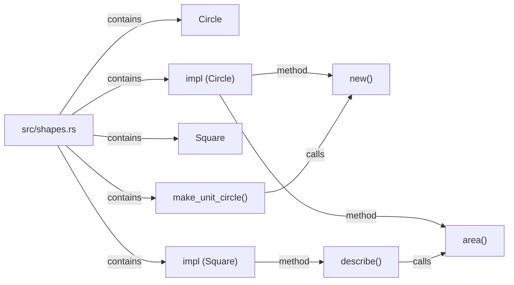
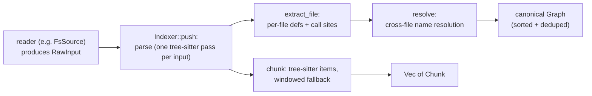

# lci-codegraph

[](https://github.com/vymalo/lci-codegraph/actions/workflows/ci.yml)
[](https://crates.io/crates/lci-codegraph)
[](https://docs.rs/lci-codegraph)
[](LICENSE)

`lci-codegraph` walks a source checkout and, from **one** tree-sitter parse per file, produces
semantic chunks and a structural call graph with cross-file resolution. It is a pure extractor — no
database, no cluster dependency — the caller decides where the graph and (unembedded) chunks go. The
one deliberate exception: when [semantic embeddings](#semantic-embeddings) are configured, the crate
itself makes a blocking HTTP call to an OpenAI-compatible `/embeddings` endpoint, because embedding is
inherently a round-trip to a model — there is no in-process model this crate could run instead. That
call is off by default and stays off until an operator sets `OPENAI_BASE_URL`.

## Install

```toml
[dependencies]
lci-codegraph = "0.1"
```

MSRV: Rust **1.88**. The crate is edition 2024 (floor 1.85), but `lopdf` — pulled in through
`pdf-extract`, and floored at a version that patches
[RUSTSEC-2026-0187](https://rustsec.org/advisories/RUSTSEC-2026-0187) — uses let-chains, stabilised
in 1.88. CI checks this floor on every build.

## Workspace layout

The repo root is a Cargo workspace, not a single crate: `Cargo.toml` at the root carries both
`[workspace]` and the `[package]` for `lci-codegraph` itself, so the `Install` line above, `src/`,
`tests/`, `examples/`, `docs/`, and the docs.rs links are all exactly where they were before the
split — nothing about depending on this crate changed. Two members live under `crates/`:

- **[`lci-codegraph-model`](crates/lci-codegraph-model)** — the vocabulary every extractor in the
  workspace has to agree on byte-for-byte: `GraphNode`, `GraphEdge`, `Graph`, the `def_node_id`
  id-formatting helper, and `FrameworkFacts`/`FrameworkCallTarget` (the seam a framework-extractor
  crate hands facts across, see below). It depends on nothing but `serde` — the bottom of the
  workspace's dependency graph, so a framework-extractor crate and this core crate can both depend
  on it without either depending on the other.
- **[`lci-codegraph-spring`](crates/lci-codegraph-spring)** — `extract_facts(&Tree, source,
  source_file) -> FrameworkFacts`: a Spring-aware sibling pass over the same `tree_sitter::Tree` this
  crate already parsed for a Java file. See [Spring-aware Java](#spring-aware-java) below for what it
  contributes.

The reason the boundary is a *crate* and not a module: a framework's annotation surface is a curated
allowlist that churns every release — Spring's own annotation set moves every major/minor, and this
repo's own Spring fixtures already straddle the `javax.persistence` → `jakarta.persistence`
migration — a different and narrower kind of coupling than a tree-sitter grammar, which changes
rarely and is maintained by someone else. Behind a crate boundary, "does the core know about Spring?"
is answerable by reading `Cargo.toml`'s dependency list. Full rationale in `docs/architecture.md` and
`docs/design/spring-aware-graph.md` §5.2.

## Quickstart

```rust
use std::path::Path;

use lci_codegraph::{WalkOptions, walk_checkout};

fn main() -> anyhow::Result<()> {
    let root = Path::new(".");
    let options = WalkOptions::builder().build_graph(true).build();

    let output = walk_checkout(root, &options)?;

    // Chunks: ready to hand to an embedding model.
    for chunk in &output.chunks {
        println!(
            "{} [{}] {:?} L{}-{}",
            chunk.file_path, chunk.chunk_type, chunk.symbol_name, chunk.start_line, chunk.end_line
        );
    }

    // Graph: definitions and the calls between them, resolved across files.
    for edge in &output.graph.edges {
        println!("{} --{}--> {}", edge.source, edge.relation, edge.target);
    }

    Ok(())
}
```

Both come out of the **same walk** — the tree is parsed once per file and fed to the chunker and the
graph builder together (`build_graph: false`, the default, skips graph extraction and returns an
empty `Graph`, so a caller that only wants chunks pays nothing extra).

## Raw inputs: the filesystem is one reader

The crate indexes **bytes, not files**. A [`RawInput`](https://docs.rs/lci-codegraph/latest/lci_codegraph/struct.RawInput.html)
is just a logical path plus content; nothing below it cares where those bytes came from. `walk_checkout`
above is a convenience built on a filesystem *reader* (`FsSource`), but it is one reader among several
possible ones — a host that already has content in memory (a git object store, a tarball stream, an
HTTP fetch, open editor buffers, rows pulled from a database) never has to materialise a checkout on
disk just to use this crate. It can build `RawInput`s directly and hand them to the indexing core in
[`input`](https://docs.rs/lci-codegraph/latest/lci_codegraph/input/index.html).

For a caller that has every input up front, [`index_inputs`](https://docs.rs/lci-codegraph/latest/lci_codegraph/fn.index_inputs.html)
takes an iterator of `RawInput` and an [`IndexOptions`](https://docs.rs/lci-codegraph/latest/lci_codegraph/struct.IndexOptions.html):

```rust
use lci_codegraph::{IndexOptions, RawInput, index_inputs};

fn main() {
    let inputs = vec![
        RawInput::text("src/main.rs", "fn main() { helper(); }\n"),
        RawInput::text("src/helper.rs", "pub fn helper() {}\n"),
        // No filename extension to detect from — a DB row, a gist, a paste — so say the language
        // explicitly instead.
        RawInput::text("gist:a1b2c3", "def greet():\n    pass\n").with_language("python"),
    ];

    let options = IndexOptions::builder().build_graph(true).build();
    let output = index_inputs(inputs, &options);

    for chunk in &output.chunks {
        println!("{} [{}]", chunk.file_path, chunk.chunk_type);
    }
    // main() --calls--> helper(), resolved across the two files above.
    for edge in &output.graph.edges {
        println!("{} --{}--> {}", edge.source, edge.relation, edge.target);
    }
}
```

For a caller that does **not** have every input up front — reading tarball entries one at a time,
say — drive the streaming [`Indexer`](https://docs.rs/lci-codegraph/latest/lci_codegraph/struct.Indexer.html)
directly instead: `push` each input as it arrives, then `finish` once:

```rust
use lci_codegraph::{IndexOptions, Indexer, RawInput};

fn index_streaming(sources: impl Iterator<Item = (String, Vec<u8>)>) -> lci_codegraph::IndexOutput {
    let options = IndexOptions::builder().build_graph(true).build();
    let mut indexer = Indexer::new(options);
    for (path, bytes) in sources {
        indexer.push(RawInput::new(path, bytes));
    }
    indexer.finish()
}
```

`FsSource` itself is public and directly usable as an `Iterator<Item = RawInput>`, not just through
`walk_checkout` — so a caller can mix filesystem inputs with in-memory ones in a single `Indexer`:

```rust,ignore
let mut indexer = Indexer::new(IndexOptions::from(&walk_options));
for input in FsSource::new(root, &walk_options)? {
    indexer.push(input);
}
indexer.push(RawInput::text("scratch/notes.md", "# TODO\n"));
let output = indexer.finish();
```

What the indexer does and does not do: `Indexer::push` applies the byte cap (`MAX_INPUT_BYTES` at the
reader level, then the tighter per-kind cap once it knows source vs PDF), the UTF-8/binary content
sniff, language detection (`RawInput::language`, falling back to `lang::from_path`), and the PDF size
bound. It does **not** filter paths — deciding which inputs are even worth handing over is the
*reader's* job, because only the reader can avoid paying to produce an input that will just be
discarded. `FsSource` is where that filtering happens for a filesystem checkout, composing the repo's
own `.gitignore` with the operator glob layer (see "The ignore model" below).

## The output model

### Chunks

A [`Chunk`](https://docs.rs/lci-codegraph/latest/lci_codegraph/struct.Chunk.html) is one embeddable
unit of source: `file_path`, `language`, `chunk_type` (`"function"`, `"class"`, `"impl"`, `"window"`,
…), an optional `symbol_name`, a 0-based `start_line`/`end_line` line range, and the `content` text.
Structured languages get tree-sitter-extracted items (functions, structs, classes, impls, methods);
everything else — or a file too large to parse, or a language with no grammar — falls back to
fixed-size overlapping line windows.

Two more fields exist for the [semantic embeddings](#semantic-embeddings) step and stay `None` unless
it runs: `embedding: Option<Vec<f32>>`, the vector returned by the embeddings endpoint, and
`embed_input: Option<String>`, the exact text that was (or would be) sent for it — the chunk's
`content` plus a graph-aware header, truncated to the configured cap. Both are
`#[serde(skip_serializing_if = "Option::is_none")]`, so JSON output is unchanged when embedding is
off.

### Graph

A [`Graph`](https://docs.rs/lci-codegraph/latest/lci_codegraph/struct.Graph.html) is a flat list of
[`GraphNode`]s (`node_id`, `label`, `source_file`, `start_line`) and [`GraphEdge`]s (`source`,
`target`, `relation`). Three relations are emitted:

- **`contains`** — a file → its top-level definitions, and a container definition (`mod`/`struct`/
  `trait`/`enum`/`class`/…) → the definitions nested inside it.
- **`method`** — a type container (`impl`/`trait`/`struct`/`enum`/`class`/`interface`) → a callable it
  defines directly. This is a specialisation of `contains` kept as its own relation.
- **`calls`** — a caller definition → a callee definition, resolved **across files**: a call recorded
  in file A can resolve to a definition in file B.

These three relations are the whole vocabulary — nothing new was added to it. What *is* new are two
additional **node kinds** a Java file can contribute when it imports Spring (see
[Spring-aware Java](#spring-aware-java) below): `route` and `external_service`. Both are plain
`GraphNode`s, not a fourth relation — a `route` node's edge to its handler method, and an
`external_service` node sitting as the `target` of a `calls` edge from whatever reaches it, are
ordinary `calls` edges between ordinary nodes. That distinction matters because `GraphNode` has no
relation-specific shape (`node_id`, `label`, `source_file`, `start_line` — the same four fields no
matter what the node represents): anything that already matches nodes by `node_id`/`label`/
`source_file` finds a `route` or `external_service` node exactly the way it finds any other, with no
change on that side at all.

Two conventions to know when reading node ids and labels:

- **Line numbers in the graph are 1-based** (`start_line: 1` is the file's first line) — unlike a
  `Chunk`'s 0-based `start_line`/`end_line`.
- **Callable labels carry a `()` suffix**: a function named `add` gets the label `add()`; a
  non-callable definition (a struct, a class, an `impl` block) keeps its bare name.

Here is a real excerpt of the committed golden (`tests/golden/sample-repo.graph.json`) — a Rust
fixture with a `main.rs` that calls into `math.rs`:

```json
{
  "nodes": [
    { "node_id": "src/main.rs", "label": "main.rs", "source_file": "src/main.rs", "start_line": 1 },
    { "node_id": "src/main.rs#3:main", "label": "main()", "source_file": "src/main.rs", "start_line": 3 },
    { "node_id": "src/math.rs#2:add", "label": "add()", "source_file": "src/math.rs", "start_line": 2 },
    { "node_id": "src/math.rs#7:print_result", "label": "print_result()", "source_file": "src/math.rs", "start_line": 7 }
  ],
  "edges": [
    { "source": "src/main.rs", "target": "src/main.rs#3:main", "relation": "contains" },
    { "source": "src/main.rs#3:main", "target": "src/math.rs#2:add", "relation": "calls" },
    { "source": "src/main.rs#3:main", "target": "src/math.rs#7:print_result", "relation": "calls" }
  ]
}
```

`main()` in `src/main.rs` calling `add()` and `print_result()` in `src/math.rs` are the two
**cross-file** `calls` edges — the part a per-file extractor cannot produce on its own.

The same fixture's `shapes.rs`, drawn as a graph:



### Pipeline



## Language support

| Language | Extensions | Chunking | Graph extractor |
|---|---|---|---|
| Rust | `.rs` | tree-sitter | Native node-kind extractor (`interesting_node` + `call_expression` navigation) — kept separate so the committed golden stays byte-stable |
| Python | `.py` | tree-sitter | The grammar's bundled `tags.scm` (`tree-sitter-python::TAGS_QUERY`) |
| JavaScript | `.js`, `.jsx`, `.mjs`, `.cjs` | tree-sitter | The grammar's bundled `tags.scm` (`tree-sitter-javascript::TAGS_QUERY`) |
| TypeScript | `.ts` | tree-sitter | JavaScript's `tags.scm` **composed with** TypeScript's `tags.scm` — the TS query alone only covers TS-specific constructs (signatures, interfaces, modules), not concrete `class`/`function`/`method`/`call` |
| TSX | `.tsx` | tree-sitter (JSX-aware grammar) | Same composed JS+TS `tags.scm`, run against the dedicated TSX grammar (the plain TypeScript grammar cannot parse JSX) |
| Java | `.java` | tree-sitter | The grammar's bundled `tags.scm` (`tree-sitter-java::TAGS_QUERY`) |

For every one of these, chunking and graph extraction share the **same** parse of the file
(`WalkOptions::build_graph`).

A few more extensions are recognised as a language *label* with no tree-sitter grammar in this crate
— `.go`, `.c`/`.h`, `.cpp`/`.cc`/`.cxx`/`.hpp`, and a generic `text` bucket for `.md`/`.txt`/`.toml`/
`.yaml`/`.yml`/`.json`. These are chunked via the windowed-line fallback only (no structured chunks,
no graph). Any file whose extension is not recognised at all is skipped entirely — not chunked, not
graphed.

Adding a language means implementing one `LanguageSupport` in `src/lang/<language>.rs` and adding it
to the registry; see `docs/architecture.md`.

## Spring-aware Java

Java gets one thing beyond the grammar's bundled `tags.scm`: when a file imports
`org.springframework.*` or `jakarta.persistence.*`, `lci-codegraph-spring::extract_facts` runs as a
sibling pass over the same parse and contributes `FrameworkFacts` — additive nodes, edges, and call
targets that `graph::resolve` folds into the graph the language-level extractor already built. A file
that imports neither pays for one `import_declaration` scan and nothing else; every other language,
and every non-Spring Java file, is unaffected.

Three things it recognises, each *syntactically provable* from the file's own AST — no XML bean
config, no `@ComponentScan`/classpath resolution, no `@Profile` evaluation (`docs/design/spring-aware-graph.md`
§5.3 explains why each stays out of scope: a confident wrong answer about wiring is worse than none):

- **HTTP routes.** Each `@GetMapping`/`@PostMapping`/`@PutMapping`/`@DeleteMapping`/`@PatchMapping`,
  or a bare `@RequestMapping`, on a method inside an `@RequestMapping`-annotated class becomes a
  `route` node — `node_id`/`label` compose the class-level prefix with the method-level suffix
  (`route:GET:/api/accounts/{email}`), and `source_file`/`start_line` point at the handler method
  itself, not a synthetic location. A `calls` edge runs from the route to the handler.
- **Outbound service boundaries.** Each `@FeignClient(name = "...")` interface becomes an
  `external_service` node (`service:payment-service`) at the interface's own declaration; a call site
  reaching one of its methods resolves to that node instead of dropping. Two files declaring the same
  `@FeignClient` name collapse to one node deterministically (lowest `source_file`/`start_line` wins)
  instead of producing duplicate `node_id`s.
- **Spring Data repository methods.** A bodiless method on an interface whose `extends`/`implements`
  clause names a Spring Data marker interface (`Repository`, `CrudRepository`, `JpaRepository`, …,
  matched by simple name) stays a valid call target instead of being excluded as an unimplemented
  declaration — Spring generates its implementation from the method name at runtime, so there is
  provably no body anywhere in source to find. This carve-out is per-file: it does not follow a
  *transitive* marker (an interface extending your own base interface that extends `JpaRepository`),
  and it does not know about the `<Name>Impl` companion-class escape hatch Spring Data itself
  supports — both present at once leaves two candidates and the resolver drops the call, which is
  correct precision-favouring behaviour but not the most useful one.

Verified end to end against a six-file fixture, `tests/fixtures/spring-repo/` (golden:
`tests/golden/spring-repo.graph.json`):

```
AccountController.java#24:getAccount     --calls--> AccountServiceImpl.java#21:findByEmail
AccountController.java#30:createAccount  --calls--> AccountServiceImpl.java#28:create
AccountServiceImpl.java#21:findByEmail   --calls--> AccountRepository.java#15:findByEmail
AccountServiceImpl.java#28:create        --calls--> service:payment-service
route:GET:/api/accounts/{email}          --calls--> AccountController.java#24:getAccount
route:POST:/api/accounts                 --calls--> AccountController.java#30:createAccount
```

The first edge is the headline case, and it is not Spring-specific at all: `AccountController` calls
`accountService.findByEmail(email)`, where the field `accountService` is typed `AccountService` — an
interface with one implementation, `AccountServiceImpl`, wired by `@Service` and constructor
injection. It resolves because of a general fix to how Java call qualifiers are recovered (see
[Limitations](#limitations) below), which turns the call's qualifier from the field name
`accountService` into its declared type `AccountService`, matching `AccountServiceImpl implements
AccountService`. The third and fourth edges are the two genuinely Spring-specific facts: a repository
method with no body anywhere in source, and a call that leaves this codebase for another one entirely.

**Not built:** DI wiring as its own relation (`injects`), and disambiguation between multiple
`@Service`/`@Component` implementations of one interface (`@Primary`/`@Qualifier`). Both are real and
scoped in `docs/design/spring-aware-graph.md` §2.3/§4.3, but gated on a read-side change in a
*different* repository — see that document's "What was built" note for why shipping the write side
alone would land edges nothing downstream could query yet.

## Configuration

`WalkOptions` ([`bon`](https://docs.rs/bon) builder) configures the filesystem reader (`FsSource` /
`walk_checkout`). Three of its six fields are **content-level** — they simply pass through to
[`IndexOptions`](https://docs.rs/lci-codegraph/latest/lci_codegraph/struct.IndexOptions.html) via
`impl From<&WalkOptions> for IndexOptions`, so a non-filesystem reader configures the identical
behaviour by building `IndexOptions` directly. Two are **FS-reader-only**: they decide which paths
`FsSource` hands over in the first place and have no `IndexOptions` equivalent at all — a reader with
no filesystem to walk has nothing to plug them into. The last, `embed`, is **`walk_checkout`-only** in
a different sense: it is not a path-filtering decision either, it is a post-processing step
`walk_checkout` runs after `Indexer::finish` returns (see [Semantic embeddings](#semantic-embeddings)),
so it has no `IndexOptions` equivalent for the same reason a non-filesystem caller wanting embeddings
calls [`embed::embed_output`](https://docs.rs/lci-codegraph/latest/lci_codegraph/embed/fn.embed_output.html)
itself rather than finding an `IndexOptions` field for it.

| Field | Default | Level | Meaning |
|---|---|---|---|
| `tuning` | `IndexTuning::default()` | content (`IndexOptions::tuning`) | Chunking/window sizing (below) |
| `build_graph` | `false` | content (`IndexOptions::build_graph`) | Build the structural graph. Off by default: a caller that only wants chunks pays no graph-extraction cost |
| `extract_pdfs` | `true` | content (`IndexOptions::extract_pdfs`) | Extract text from PDFs and chunk it |
| `respect_gitignore` | `true` | **FS-reader-only** | Honour the repo's own `.gitignore` (and nested/parent ignore files) |
| `extra_ignore_globs` | `[]` | **FS-reader-only** | Operator-supplied gitignore-syntax globs, layered on top of the built-in defaults |
| `embed` | `None` | **`walk_checkout`-only** | `Some(EmbedConfig)` embeds every chunk against an OpenAI-compatible endpoint after `Indexer::finish` returns (see [Semantic embeddings](#semantic-embeddings)); `None` dials out to nothing. [`walk_checkout_from_env`](https://docs.rs/lci-codegraph/latest/lci_codegraph/fn.walk_checkout_from_env.html) sets this from `EmbedConfig::from_env()` |

A caller driving the raw-inputs core directly (`index_inputs`/`Indexer`) builds
[`IndexOptions`](https://docs.rs/lci-codegraph/latest/lci_codegraph/struct.IndexOptions.html) instead —
the same `tuning`/`build_graph`/`extract_pdfs` three fields, with the same defaults, and no ignore or
embed fields at all (path filtering isn't its job, and embedding is a driver-level step layered on top
via `embed::embed_output`; see "Raw inputs: the filesystem is one reader" above).

`IndexTuning` fields, each readable from an environment variable via
[`IndexTuning::from_env`](https://docs.rs/lci-codegraph/latest/lci_codegraph/struct.IndexTuning.html)
(unset or unparseable falls back to the default; every value is clamped to `>= 1`):

| Field | Env var | Default | Meaning |
|---|---|---|---|
| `embed_batch_size` | `INDEX_EMBED_BATCH_SIZE` | `32` | Chunks per embedding round-trip |
| `max_chunk_lines` | `INDEX_MAX_CHUNK_LINES` | `150` | Max lines a structured chunk may span before falling back to windowing |
| `window_size` | `INDEX_WINDOW_SIZE` | `100` | Windowed-fallback window size, in lines |
| `window_step` | `INDEX_WINDOW_STEP` | `50` | Windowed-fallback step, in lines (overlap = `window_size - window_step`) |

[`walk_checkout_from_env(root, build_graph)`](https://docs.rs/lci-codegraph/latest/lci_codegraph/fn.walk_checkout_from_env.html)
is a convenience that builds `WalkOptions` from the environment: `IndexTuning::from_env()` for
tuning, and `LCI_CODEGRAPH_IGNORE_GLOBS` (newline- or comma-separated) for `extra_ignore_globs`.
`build_graph` itself is a plain function argument, not read from the environment.

## The ignore model

The operator ignore layer **composes with** the repo's own `.gitignore` — it does not replace it.
`walk_checkout` drives the file walk with [`ignore::WalkBuilder`](https://docs.rs/ignore), which
honours the repo's `.gitignore` (and nested/parent ignore files) natively when `respect_gitignore` is
true; `IgnoreList` is then applied as an *additional* filter on top, so a junk directory that slipped
past the repo's own rules (or a repo with no `.gitignore` at all) still gets skipped. Every skip is
logged at `debug`/`info` so an over-broad glob is diagnosable rather than silently hiding real files.

`DEFAULT_IGNORE_GLOBS` — the built-in defaults, always included unless a caller builds `IgnoreConfig`
directly with `include_defaults(false)`:

```
target/  node_modules/  .git/  dist/  build/  vendor/  .venv/  venv/  .next/  __pycache__/
```

## Stats

Every run — `walk_checkout`, `index_inputs`, or a manual `Indexer` — returns
[`IndexStats`](https://docs.rs/lci-codegraph/latest/lci_codegraph/struct.IndexStats.html) on
`output.stats`, and logs the same counters at `info` on `finish`. They exist because, with raw inputs,
"nothing got indexed" can mean several different things from the outside, and the counters tell them
apart:

| Field | Meaning |
|---|---|
| `files_chunked` | Inputs that produced at least one chunk |
| `paths_ignored` | Inputs a reader pruned before they ever reached `Indexer::push` (e.g. `FsSource` skipping a `.gitignore`d or operator-ignored path) |
| `pdfs_extracted` | PDFs successfully text-extracted |
| `pdfs_skipped` | PDFs over the byte cap or that failed extraction |
| `files_skipped_binary` | Content rejected as binary: either it fails UTF-8 decoding outright, or it decodes fine but trips the content sniff (a NUL byte in the first 512 bytes) |
| `files_skipped_too_large` *(new)* | Inputs over `chunk::MAX_FILE_BYTES`, rejected before any parse/decode work |
| `files_skipped_unsupported` *(new)* | Inputs with no determinable language: `RawInput::language` was `None` and `lang::from_path` couldn't classify the path either (and it wasn't a PDF) |

`files_skipped_too_large` and `files_skipped_unsupported` are new with the raw-inputs core: a raw
input often has no meaningful filename or a size nobody validated up front — a DB row, a gist, an
editor buffer — so both failure modes needed their own counter instead of silently landing in
`files_skipped_binary` or vanishing. `files_skipped_binary` itself now also covers UTF-8 decode
failures; previously that path incremented nothing at all.

## PDF handling

Repos carry documentation as PDFs; those get bounded text extraction and are fed to the same
windowed-chunk path plain text files take. PDF parsing over **untrusted repo input** is a crash/OOM/
hang surface, so extraction is bounded in layers:

- Input bytes are capped at the I/O level (`MAX_PDF_BYTES`, 5 MiB) **before** the parser ever sees the
  file — a multi-gigabyte "PDF" never lands in memory whole.
- Before the real parser runs, every `FlateDecode` content stream is pre-flighted through a bounded
  inflate (`MAX_PDF_DECOMPRESSED_BYTES`, 256 MiB cumulative budget) that never materialises more than
  a small buffer, rejecting a decompression bomb before it can trigger an (uncatchable) allocation
  failure.
- The real parse runs on a worker thread under a 15s (`PDF_PARSE_TIMEOUT`) watchdog.
- The parser call is wrapped in `catch_unwind` (`pdf-extract` can panic on malformed input), and
  extracted text is truncated to `MAX_PDF_TEXT_BYTES` (2 MiB).

Honest residual limits, documented in `src/pdf.rs`: the decompression guard only covers `FlateDecode`
streams found by a syntactic scan — a bomb behind a non-Flate or cascaded filter, or a blow-up in
font/glyph tables rather than stream inflation, is not pre-flighted. The wall-clock watchdog is the
only backstop for those, and on timeout the worker thread is *abandoned*, not killed — its memory is
not reclaimed. A hard per-parse memory ceiling (subprocess + `RLIMIT_AS`) is not implemented here; a
caller running this over fully untrusted input at scale should isolate the process accordingly.

## Semantic embeddings

Set `OPENAI_BASE_URL` and `walk_checkout` embeds every chunk it produces against an OpenAI-compatible
`/embeddings` endpoint — no local/in-process model, no Cargo feature gate. Leave it unset and nothing
changes: no request is ever made, `Chunk::embedding` stays `None` on every chunk, and the walk costs
exactly what it cost before this existed.

The embed step itself, [`embed::embed_output`](https://docs.rs/lci-codegraph/latest/lci_codegraph/embed/fn.embed_output.html),
takes an [`IndexOutput`](https://docs.rs/lci-codegraph/latest/lci_codegraph/struct.IndexOutput.html)
rather than anything filesystem-specific, so it isn't only for `walk_checkout` — a caller driving
`index_inputs`/`Indexer` directly (see "Raw inputs: the filesystem is one reader" above) gets the same
graph-aware embedding by calling it themselves once their own indexing run finishes. `walk_checkout`
is simply the one caller that does this for you, wired through `WalkOptions::embed`.

`OPENAI_BASE_URL` is **the switch**: [`EmbedConfig::from_env`](https://docs.rs/lci-codegraph/latest/lci_codegraph/struct.EmbedConfig.html#method.from_env)
returns `None` when it is unset or blank, and [`walk_checkout_from_env`](https://docs.rs/lci-codegraph/latest/lci_codegraph/fn.walk_checkout_from_env.html)
wires that straight into `WalkOptions::embed`. The API key is a separate, optional knob —
`OPENAI_API_KEY` absent (or blank) means an *unauthenticated* endpoint, which is a legitimate
configuration, not a missing one: a local gateway, vLLM, or Ollama's OpenAI-compatible shim typically
needs no key at all.

| Env var | Maps to | Default | Meaning |
|---|---|---|---|
| `OPENAI_BASE_URL` | `EmbedConfig::base_url` | unset | **The switch.** Unset or blank → nothing is embedded, zero extra requests. Set → the API base, e.g. `https://api.openai.com/v1`; the request URL is `{base_url}/embeddings` |
| `OPENAI_API_KEY` | `EmbedConfig::api_key` | `None` | Sent as `Authorization: Bearer <key>` only when set. Blank/whitespace-only counts as unset |
| `OPENAI_EMBEDDING_MODEL` | `EmbedConfig::model` | `text-embedding-3-small` | Falls back to the default when unset |
| `OPENAI_EMBEDDING_DIMENSIONS` | `EmbedConfig::dimensions` | `None` | Passed through as the request's `dimensions` field only when set (not every server accepts it). Unparseable → `None`, not an error |
| `OPENAI_EMBEDDING_TIMEOUT_SECS` | `EmbedConfig::timeout` | `30` | Per-request timeout, in seconds. Unparseable or `0` → default |
| `OPENAI_EMBEDDING_MAX_RETRIES` | `EmbedConfig::max_retries` | `3` | Retries on `429` / `5xx` / transport error, exponential backoff starting at 500ms. Unparseable → default; `0` is legal (no retry) |
| `OPENAI_EMBEDDING_MAX_INPUT_CHARS` | `EmbedConfig::max_input_chars` | `8000` | Each input is truncated to this many **chars** (not bytes) before being sent. Unparseable or `0` → default |

There is deliberately no `OPENAI_EMBEDDING_BATCH_SIZE`: batch size reuses the **existing**
`INDEX_EMBED_BATCH_SIZE` / `IndexTuning::embed_batch_size` knob (default 32, see
[Configuration](#configuration)) rather than adding a second name for the same setting.
`EmbedConfig::max_context_refs` (default `8`, the max callees and max callers listed in the context
header, each side capped independently) has no environment variable — set it through the `EmbedConfig`
builder directly.

### What actually gets embedded

The text sent to the model is **graph-aware**, not just `chunk.content` on its own:
`embed::embed_chunks` builds a small index over the resolved `Graph` once per walk and prepends a
deterministic header — enclosing container, callees, callers — ahead of each chunk's own source.

Below is the header produced for `add` in a three-file Rust checkout where `src/math.rs` defines
`impl Calculator { pub fn add(..) }`, `add` calls `helper`/`log` in `src/util.rs`, and `main` in
`src/main.rs` calls `add`:

```
// file: src/math.rs
// language: rust
// function: add
// within: impl
// calls: helper() [src/util.rs], log() [src/util.rs]
// called by: main() [src/main.rs]

pub fn add(&self, x: i32) -> i32 {
        helper(x) + log(x)
    }
```

Two things that example is showing honestly rather than prettily. The `within:` line reads `impl`,
not `impl Calculator` — a Rust `impl` block's graph label is the bare node kind, because the block
has no name of its own to take (see the `label` rule in `src/graph/emit.rs`), so for Rust the
`within:` line tells the model *that* a method sits in an impl but not which type's. A `class` in
Python/TypeScript/Java, which does have a name, renders as `// within: Calculator`. And the content
keeps the source's original interior indentation while starting flush at `pub` — the chunk is the
node's exact byte range, not a re-indented copy.

`file:` and `language:` are always present. The third line is `{chunk_type}: {symbol_name}` when the
chunk has a symbol name, else the bare `{chunk_type}` (a windowed chunk with no symbol renders as
`// window`). `within:`, `calls:`, and `called by:` are each omitted entirely when there's nothing to
say — a `window` chunk, a PDF chunk, or any chunk from a walk with `build_graph: false` maps to no
graph node at all, so its header is just the first three lines. `calls:`/`called by:` entries are
`label [source_file]`, sorted and deduplicated, capped at `max_context_refs` per side; a truncated list
gets a trailing marker, e.g. `// calls: aaa() [b.rs], target() [b.rs] (+1 more)`. Every header uses `//`
regardless of the chunk's actual language — the header is never compiled, only read by the embedding
model, so a per-language comment token would buy nothing. The whole thing (header + content) is then
truncated to `max_input_chars` **chars**, preserving the header and cutting `content` first; only a
header that alone exceeds the cap gets cut itself.

The result lands on the chunk: `Chunk::embed_input` holds the exact text that was sent (or would be,
once truncation applies), and `Chunk::embedding` holds the vector that came back.

### Caveats

- **A failed embedding call fails the whole walk.** `walk_checkout` returns `Err` rather than an
  output with some chunks embedded and others not — configured means required here, because a
  half-embedded index that looks complete is worse than a walk that visibly failed.
- **No graph, degraded header.** With `embed` configured but `build_graph: false`, every chunk maps to
  no graph node, so the header is `file:`/`language:`/symbol only — no `within:`, `calls:`, or
  `called by:` lines. The walk does not force `build_graph` on to compensate — that would silently
  change the cost profile of a walk a caller configured without it — it logs a `tracing::warn!`
  instead.
- **The endpoint sees your source code.** Every chunk's content (up to `max_input_chars`) goes out in
  the request body to whatever `OPENAI_BASE_URL` points at. Pointing it at a third-party host is a
  data-egress decision the operator is making, not one this crate can make safe on its behalf.

## Testing

```sh
cargo test
```

runs the unit tests (each module) and the integration suite `tests/parity.rs`, which walks a
committed fixture repo (`tests/fixtures/sample-repo`) and asserts the canonicalised graph is
byte-identical to the committed golden (`tests/golden/sample-repo.graph.json`) — the regression guard
for the graph engine. Regenerate the golden intentionally with:

```sh
UPDATE_GOLDEN=1 cargo test --test parity
```

```sh
cargo test --features container-tests
```

additionally runs the Docker-backed suites — each needs a **running Docker daemon**:

- `container_neo4j` — loads the emitted nodes/edges into a real Neo4j with the same generic
  `:Symbol` + `[:REL {relation}]` write a downstream host performs, then runs the retrieval queries
  against it, proving the downstream retrieval contract end to end.
- `container_build` — builds and runs the crate inside Linux glibc and musl containers.
- `container_repos` — clones pinned real-world repositories inside a container and asserts the walk
  holds its invariants on input nobody wrote for the tests.

## Determinism

The graph returned by `walk_checkout`/`walk_checkout_from_env` is canonicalised: nodes and edges are
sorted and deduplicated before being returned (`Graph`'s `resolve` step). Running the same walk twice
over the same checkout produces byte-identical output — stable to snapshot in a golden test, and
stable to submit downstream without spurious diffs.

## Limitations

Cross-file `calls` resolution is precision-favouring, not best-effort: when a bare callee name matches
**more than one** definition and no qualifier narrows it to exactly one, the call is **dropped**, not
guessed — it is never fanned out to every same-named candidate and never resolved to an arbitrary one.
Concretely: a name defined in two files with no importing/qualifying context to tell them apart
produces no `calls` edge for that call site.

A qualifier is recovered structurally, not through full type inference — and how much it recovers
depends on the language. For **Java**, a call through a field, formal parameter, local variable,
enhanced-`for` variable, or caught exception (`h.help()`) resolves the qualifier to the receiver's
**declared type** (`Helper`, not `h`), recovered by walking the same file's AST back to where `h` was
declared; a qualifier naming an interface or superclass the candidate's enclosing type
`extends`/`implements` also counts as a match, not only an exact name (this is what lets
`accountService.findById()` resolve to the interface's sole implementation with no Spring knowledge
involved — see [Spring-aware Java](#spring-aware-java) above). For every other language (Rust, Python,
JavaScript/TypeScript/TSX), the qualifier is still just the literal receiver text (`Foo.bar()` →
`Foo`). In every language, `self`/`this`/`cls`/`super` receivers carry no qualifier — they are
deliberately treated as unqualified rather than given a bogus type name. Two limits remain even for
Java: there is no *cross-file* type resolution (a receiver whose declaration — an inherited field from
a superclass in another file, say — isn't found by walking the call's own file falls back to the bare
identifier text, exactly as it did before this fix), and no classpath — an interface/superclass is
matched by simple name only, never against an imported fully-qualified type, so two same-named
interfaces from different packages are indistinguishable. A single match still resolves either way;
multiple candidates still drop. This trades recall for not mis-attributing a call to the wrong
definition.

## Provenance

Exported from [`vymalo/lightbridge-code-intelligence`](https://github.com/vymalo/lightbridge-code-intelligence).
Design rationale: [ADR-0086](docs/adr/0086-in-house-code-graph-crate.md). Licensed under
[MIT](LICENSE).
