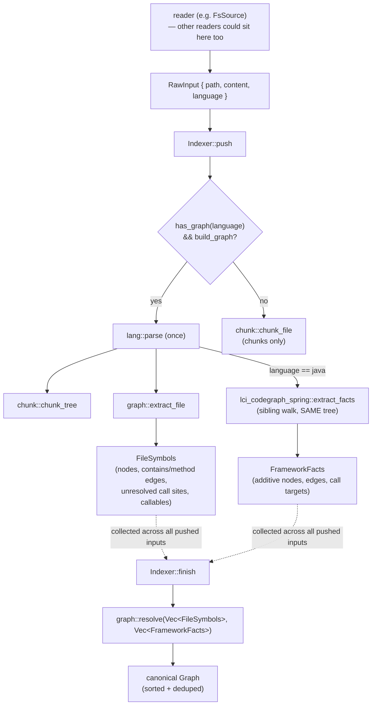
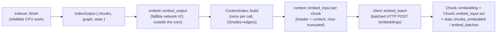

# Architecture

This is the document to read before touching `src/graph/`. It describes how the pipeline actually
fits together, based on the code as it stands — not the aspirational shape.

## Workspace layout

The repo root is a Cargo workspace, not a single crate. `Cargo.toml` at the root carries both
`[workspace]` and the `[package]` for `lci-codegraph` itself — `src/`, `tests/`, `examples/`, and
`docs/` all keep their existing paths, so nothing about the published crate's layout, the README, or
the docs.rs links moved. The one thing that *did* move out is `crates/lci-codegraph-model`: the shared
node/edge vocabulary ([`GraphNode`](../src/graph/mod.rs), `GraphEdge`, `Graph`) plus the `def_node_id`
id-formatting helper, now defined in that crate and re-exported by `src/graph/mod.rs` so
`lci_codegraph::graph::GraphNode` (and the crate-root re-export in `src/lib.rs`) resolve exactly as
before — the public API of `lci-codegraph` is unchanged by the split.

The reason it is a *crate* boundary and not a plain module: `docs/design/spring-aware-graph.md` §5.2
observes that a framework's annotation surface (Spring's `@Service`/`@FeignClient`/Spring-Data-marker
allowlist) is a **curated allowlist that churns every release** — a materially different, narrower kind
of coupling than a tree-sitter grammar, which changes rarely and is maintained by someone else. A
framework-extractor crate needs to speak the exact same vocabulary `lci-codegraph` does (byte-identical
node ids in particular — a framework-emitted edge to a handler method has to land on the same id
`emit.rs` produced for it) without pulling in this crate's tree-sitter-parsing internals, and without
this crate ever needing to depend back on a framework crate to understand its output. `crates/lci-codegraph-model`
depends on nothing but `serde` — it is the bottom of the workspace's dependency graph, and the one place
both sides of that seam can meet. The practical payoff: "does the core know about Spring?" is a question
answerable by reading `Cargo.toml`'s dependency list, not by auditing every module for a stray `use`.

## The one-parse design

Everything downstream of a source file starts from a single `tree_sitter::Tree` — and, since the
raw-inputs cutover (ADR-0086), everything upstream of that starts from a
[`RawInput`](../src/input.rs) rather than a file on disk. `src/input.rs`'s `Indexer::push` is where
the one-parse decision is actually made: given one `RawInput`, it parses the content **once**
(`lang::parse`) and hands that one tree to:

- the chunker (`chunk::chunk_tree`),
- the graph extractor (`graph::extract_file`), when `IndexOptions::build_graph` is set, and
- for a Java input specifically, the Spring framework sibling pass (`lci_codegraph_spring::extract_facts`,
  `crates/lci-codegraph-spring`).

That third one is worth dwelling on, because it is the shape any *other* framework-extractor crate
this project ever adds should follow. `docs/design/spring-aware-graph.md` §3.2 rejected teaching
`graph::extract_file`'s `Classifier` about Spring outright: `Classifier` answers exactly three
questions (definition? call site? enclosing scope?), and an annotation or a generic type argument is
a different *kind* of fact than that seam is shaped for. So `lci-codegraph-spring` does not extend or
wrap `extract_file` — it walks the identical `tree_sitter::Tree` a second time, independently, looking
at node kinds (`marker_annotation`, `super_interfaces`, `type_arguments`) `extract_file`'s walk never
inspects. Both walks read the same immutable tree; neither knows the other ran. This is still the
one-parse design, not an exception to it — "one parse" has always meant "`lang::parse` runs once per
input," not "the tree is visited once." Gated to `language == "java"` in `Indexer::push`: every other
language pays nothing beyond that one string comparison, and Java repos that never import Spring pay
one cheap `import_declaration` scan inside `lci-codegraph-spring` itself before it gives up (see that
crate's own docs).

`Indexer::push` never touches a filesystem itself — it only ever sees a `RawInput` that something
else already produced. `src/walk.rs`'s `FsSource` is what turns a checkout into that stream of
`RawInput`s: it walks the tree, applies both ignore layers, reads each surviving file's bytes, and
yields one `RawInput` per file. `walk_checkout` is the thin driver that wires the two together —
build an `FsSource`, `push` everything it yields into an `Indexer`, record the pruned count, `finish`.
Nothing about the one-parse design is specific to the filesystem: any other reader that can produce
`RawInput`s (a git object store, a tarball, an HTTP fetch, editor buffers, DB rows) gets the same
one-parse behaviour for free by feeding the same `Indexer`. See the "reader/indexer seam" section
below for what belongs on which side of that line.

This one-parse path only happens on the fast path — a language with a real graph extractor
(`lang::has_graph(language)`). If graph extraction is off, or the language has no extractor, the input
is chunked via `chunk::chunk_file`, which re-parses internally if it needs to; there is no second
parse when both chunking and graph extraction run, which is the case the one-parse design exists for.
The framework sibling pass only ever runs alongside graph extraction, for the same reason: it has
nothing to contribute to a chunk, and would be dead work if `build_graph` were off.



`Indexer` collects one `FileSymbols` per graph-eligible input into a `Vec<FileSymbols>` as `push` is
called, and — for Java inputs only — one `FrameworkFacts` per input into a sibling `Vec<FrameworkFacts>`,
alongside it. `finish` calls `graph::resolve` exactly once at the end, over everything that was pushed
— cross-file resolution needs every input's definitions to exist before it can attribute a call
correctly, and that is just as true of a framework's cross-file facts (a `@FeignClient` boundary named
in one file, called from another) as it is of a plain function call.

## The reader/indexer seam

`src/input.rs` and `src/walk.rs` are split along a deliberate seam, and the module doc comments on
both sides say so explicitly — this section is the model to follow when reasoning about it, or when
deciding which side a new piece of logic belongs on.

`crate::input` is the source-agnostic core: `RawInput`, `IndexOptions`, `Indexer`, `index_inputs`. It
knows a path and some bytes and nothing else — not where they came from, not whether a filesystem was
ever involved. Everything it does is a function of the bytes it was handed: the byte cap, the
UTF-8/binary sniff, language detection, the one-parse chunk+graph dispatch, PDF extraction.

`crate::walk` is one *reader*: `FsSource`, a filesystem-specific `Iterator<Item = RawInput>`, plus the
`walk_checkout` convenience driver built on top of it. A reader's job is narrower than it looks from
the outside — it does not index anything itself. It only decides *which* inputs are worth producing
at all, and turns each surviving one into a `RawInput`.

**Path filtering — the ignore layers — sits in the reader, not the indexer, and this is the one rule
worth internalising about the seam.** It would be easy to imagine `Indexer::push` taking a path and
deciding whether to bother with it. That is exactly backwards: by the time a `RawInput` reaches
`push`, its bytes have already been read off disk (or fetched over HTTP, or pulled from a DB row) —
the expensive part is done. A reader that knows in advance it will discard a path (a `.gitignore`d
file, a `node_modules` subtree, an operator-configured glob) can skip producing the `RawInput` for it
entirely, and `FsSource` does exactly that: its `filter_entry` callback prunes a directory *before
walking into it*, so an ignored subtree's files are never even stat'd, let alone read. Putting that
decision in `Indexer::push` instead would mean every reader — including ones for which "path" barely
means anything, like a database row — pays to produce an input just to have it thrown away, and would
give the indexing core an ignore-list dependency it has no other reason to carry. `Indexer` does still
participate: a reader that pruned inputs before `push` ever saw them reports the count via
`Indexer::record_pruned`, so `IndexStats::paths_ignored` reflects reader-side pruning without the
indexer needing to know *why* those inputs never arrived.

What *does* belong on the indexer side, correspondingly, is anything that can only be decided from the
content itself, because a reader — by construction — has not looked at the bytes yet when it decides
whether to hand them over. The byte cap, the UTF-8 decode, the binary content sniff, and language
detection are all content-level judgment calls `Indexer::push` makes once it has the bytes in hand;
`MAX_INPUT_BYTES` is the one exception that leans the other way on purpose — it is a content-level
constant, but reader-facing, specifically so a reader can bound its own read at the I/O level (as
`FsSource` does, reading at most `MAX_INPUT_BYTES + 1` bytes) rather than pulling an oversized input
into memory whole only to have `push` reject it after the fact.

## The `Classifier` seam

`src/graph/emit.rs` runs one shared depth-first walk (`walk`) that emits definition nodes,
`contains`/`method` edges, and unresolved call sites. What differs per language is *how a tree-sitter
node is recognised as a definition or a call site* — that recognition is factored out behind
`emit::Classifier`:

```rust,ignore
enum Classifier<'a> {
    Rust,
    Tagged(&'a tags::TaggedSymbols),
}
```

- **`Classifier::Rust`** delegates to the same `interesting_node` function the chunker uses
  (`chunk::interesting_node`, matching on tree-sitter node kinds like `function_item`, `impl_item`,
  `struct_item`) plus a dedicated `call_expression` navigation (`graph::callee::callee_ref_of`) for
  call sites. This is Rust's own hand-written node-kind extractor. It exists so chunk and graph
  symbols stay in lock-step for Rust specifically, and so the committed golden
  (`tests/golden/sample-repo.graph.json`) is byte-stable — a property a query-driven extractor
  running someone else's grammar-authored query would not guarantee across grammar upgrades.
- **`Classifier::Tagged`** wraps a `tags::TaggedSymbols` — the result of running the language's
  bundled `tags.scm` query (`tags::extract`) once per file, *before* the DFS starts. Every other
  supported language (Python, JavaScript, TypeScript, TSX, Java) goes through this path. The tags
  query gives definitions (`@definition.function`, `@definition.class`, …) and call references
  (`@reference.call`) keyed by tree-sitter node id, which `Classifier::Tagged::classify`/`call_site`
  look up by node id during the walk.

Which classifier a language uses is decided once, per file, by `lang::LanguageSupport::graph_strategy`
(`GraphStrategy::RustNative` vs. `GraphStrategy::Tags(&'static Query)`) — see `src/lang/mod.rs`. This
is the single place that determines Rust-native vs. tags-based; the rest of `emit.rs`,
`graph::callee`, and `graph::resolve` are written against the `Classifier` abstraction and do not
know or care which source produced it.

What the tags query does **not** give — and what `emit.rs` still derives from the tree itself,
identically for both classifier variants — is containment (which definition is nested inside which)
and the call qualifier (the receiver of a qualified call, e.g. the `Foo` in `Foo.bar()`). Both are
positional facts about where a node sits in the tree, not something a flat tag list carries.
`Classifier::container_scope` and `Classifier::call_site`'s qualifier handling exist specifically to
recover those two facts uniformly, regardless of classifier source.

## Per-file extraction: recording, not resolving

`graph::extract_file` produces a `FileSymbols` for one file:

- `nodes: Vec<GraphNode>` — the file node itself (`node_id` = the file path, 1-based `start_line: 1`)
  plus one node per definition found by the walk.
- `contains: Vec<GraphEdge>` — the `contains`/`method` edges, fully resolved *within this file* (a
  definition's parent is always known at emission time — it is the top of the `stack` the DFS
  maintains).
- `calls: Vec<CallSite>` — **unresolved**. Each is `{ caller: String, name: String, qualifier:
  Option<String> }`: the enclosing definition's node id, the bare callee name, and an optional
  qualifier. Nothing here is a graph edge yet — resolving a `CallSite` to an actual target definition
  requires knowing about definitions in *other* files, which isn't available until every file has
  been walked.
- `callables: Vec<Callable>` — every function/method definition found, `{ name, node_id, scope }`,
  where `scope` is the enclosing type name (a Rust `impl S` or a `class C`) used only to disambiguate
  same-named callables later. This is the table `resolve` matches call sites against.

The DFS (`emit::walk`) threads three pieces of state as it descends: a `stack` of enclosing definition
node ids (for `contains` parenting and for attributing a call site to its caller), a `scope` (the
nearest enclosing type name, for method disambiguation), and an `enclosing_kind` (to decide whether a
callable directly inside it should be a `method` edge — `is_type_container` matches `impl`/`trait`/
`struct`/`enum`/`class`/`interface` — or a plain `contains`).

Node ids are deterministic and content-derived: `def_node_id` formats them as
`<file>#<line>:<name-or-kind>` (e.g. `src/shapes.rs#9:new`), so the same input always produces the
same id — no counters, no UUIDs.

## Cross-file resolution

`graph::resolve::resolve(files: Vec<FileSymbols>, framework: Vec<FrameworkFacts>) -> Graph` is the
only place that looks across files. It builds two lookup tables keyed by bare callee name:

1. a **global** table (`HashMap<&str, Vec<&Callable>>`) covering every callable in every file, and
2. for each file in turn, a **local** table covering only that file's callables.

For each unresolved `CallSite`, resolution tries the local table first (same-file definitions win),
falling back to the global table only when the local table has no match, or when the local match is
itself ambiguous and the global table can still narrow it down. This local-first policy means a
same-named definition in another file never shadows an unambiguous local one.

`framework`'s `call_targets` (a Spring Data repository method with no body anywhere in source; a
`@FeignClient` boundary whose real implementation lives in a different repository entirely — see
`docs/design/spring-aware-graph.md` §4.3) are converted to the same private `Callable` shape and
folded into the **global** table only, before any file's `CallSite`s are resolved — never into any
file's local table. The reasoning is the same shape as the local-first policy just above it, one level
up: a framework call target is cross-file by construction (the caller is essentially never in the same
file as a repository interface or a Feign client), so there is no "this file's own definition" for it
to be. Keeping it global-only is also what guarantees it can never shadow a real local definition — the
local table is still tried first, unconditionally, for every call. `resolve` itself stays completely
unaware that any of this is "Spring": `FrameworkCallTarget::scope`/`scope_supers` mirror `Callable`'s
fields exactly, so `pick`'s qualifier matching (below) treats a framework-contributed candidate exactly
like a language-level one, through the identical code path.

### How ambiguity is handled

The core of `pick()` is a three-way outcome, not a boolean:

```rust,ignore
enum Pick<'a> {
    One(&'a str),   // exactly one candidate — emit the edge
    Ambiguous,      // several same-named candidates, qualifier didn't narrow it — drop, count
    None,           // no candidate in this table — try the next one
}
```

- **A single candidate** resolves, unless a *type* qualifier is present and positively contradicts it
  (`only.scope.as_deref() != Some(q)`) — a *module*-style qualifier that isn't a type scope still
  matches, so `math::add()` resolves to a free function `add` with no type scope.
- **Several same-named candidates** resolve only if a qualifier narrows the set to exactly one match
  on `scope`. Otherwise the call is **ambiguous** — and an ambiguous call is *dropped*, not resolved
  to an arbitrary candidate and not fanned out to every candidate. This is the deliberate,
  precision-favouring choice documented directly in `resolve.rs`: "a bare name matching several
  same-named defs is dropped and counted, not fanned out."

Concretely: if `foo()` is defined in two files and the call site has no qualifier that can tell them
apart, `resolve` produces **no** `calls` edge for that call — not one arbitrary one, and not two. This
trades recall for never mis-attributing a call to the wrong definition. `ambiguous`/`unresolved`
counts are logged (`tracing::debug!`) so this is visible, not silent.

Qualifiers themselves are recovered structurally, not through type inference:
`graph::callee::qualifier_from_callee_node` looks at the callee name node's *immediate* parent in the
tree (`member_expression`/`attribute`/`method_invocation`) and takes its `object`/receiver, but only
when that receiver is a plain identifier that isn't `self`/`cls`/`this`/`super` (those carry no type
information and are deliberately treated as "no qualifier" rather than a bogus one). There is no
attempt to resolve a receiver's actual type — a call through a variable of unknown type resolves the
same as an unqualified call.

## Canonicalisation

After every file's call sites are resolved, `framework`'s nodes and edges are appended — additive,
already fully resolved (both endpoints known without any further cross-file work; see
`FrameworkFacts`'s own doc comment for why the type can only ever add, never override or remove) — and
then `resolve` sorts and dedups both `nodes` and `edges` (`GraphNode`/`GraphEdge` derive `Ord`) before
returning the `Graph`. This is what makes the output stable enough to snapshot as a golden file and
stable enough to submit downstream without spurious diffs between runs over the same input.

Plain sort+dedup only removes *exact* duplicates, which is all a language-level extractor can ever
produce — a definition's `node_id` already embeds its own file and line, so two different definitions
never collide on it. A framework-contributed node can: the same `@FeignClient(name = "payment-service")`
declared in two files mints the same `node_id` twice, with two genuinely different
`source_file`/`start_line` — two structurally different `GraphNode`s an exact-equality dedup cannot
tell apart as "the same thing," which would otherwise leave the output with duplicate `node_id`s (an
invariant `tests/container_repos.rs` checks). `resolve` runs one further pass,
`dedup_colliding_node_ids`, that collapses any node_id collision down to exactly one node, choosing the
one with the lexicographically lowest `(source_file, start_line)` — deterministically, not by whichever
happened to be pushed or walked first, because an arbitrary winner would make the emitted graph depend
on input order and break both the committed goldens and the "two runs over the same checkout produce
byte-identical JSON" guarantee.

## Where embedding sits

The honest statement is: **after `Indexer::finish()` resolves the graph, outside the indexing core**,
because `Indexer` is infallible CPU work and embedding is fallible network I/O. Those two things must
not merge into one struct. `Indexer`/`IndexOptions` (`src/input.rs`) know nothing about the network —
no `embed` field, nothing embed-shaped inside `push`/`finish` — for the same reason path-filtering
lives in the reader and not the indexer (see "The reader/indexer seam" above): folding a fallible,
externally-latent operation into the one piece of this crate that's supposed to be pure, deterministic
CPU work would mean a slow or down embeddings endpoint can now make *indexing itself* fail, when
indexing and embedding are genuinely two different concerns with two different failure models.

`embed::embed_output(&mut output: &mut IndexOutput, config, batch_size)` is the seam: it takes
whatever an `Indexer::finish()` (or `index_inputs`, or a manual `Indexer`) already produced and embeds
it in place. That signature is deliberate — an `IndexOutput` carries no opinion about which reader
built it, so `embed_output` is available to **any** reader, not just the filesystem walk: `walk_checkout`
calls it, but so could a caller driving `index_inputs`/`Indexer` directly over a tarball or a set of DB
rows. This is exactly the generalisation the reader/indexer split (ADR-0086) exists for — a new reader
gets embedding for free by calling the same function, rather than reimplementing it.

The text `embed::embed_chunks` (which `embed_output` wraps) sends to the model is prefixed with a
header built by `embed::context::ContextIndex` — enclosing container, callees, callers — and that
index is built from `graph.edges`. A `calls` edge only exists once every input's `FileSymbols` has
been collected and handed to `resolve` (see "Cross-file resolution" above): a caller in `a.rs` calling
a callee in `b.rs` has no resolved edge, in either direction, until `b.rs` has been indexed too.
Embedding a file's chunks as soon as that file is chunked — instead of waiting for `Indexer::finish` —
would mean every cross-file reference in the header is simply absent for whichever input the reader
happens to hand over first, which is not "sometimes incomplete", it is "wrong for anything that isn't
a leaf file with no external callers or callees". That is the concrete reason embedding cannot be
folded into `Indexer::push`, on top of the fallibility argument above.

`walk_checkout`'s embed step, concretely: call `indexer.finish()` as always, then — only when
`WalkOptions::embed` is `Some` — pass the resulting `IndexOutput` to `embed::embed_output`, which
builds the `ContextIndex` once over the finished `Graph`, maps each chunk back to the graph node at its
location (`ContextIndex::map_chunk` — the file plus line, with the one wrinkle that `Chunk::start_line`
is 0-based and a graph node's is 1-based), and only then batches chunks out to the embeddings endpoint,
folding the result into `output.stats.chunks_embedded`/`embed_batches`.



When `IndexOptions::build_graph` is `false`, `graph::resolve` is never called and `Indexer::finish`
returns `Graph::default()` — an empty graph with no nodes and no edges. `ContextIndex::build` over that
still succeeds (there's simply nothing to index), so every chunk maps to no node and every header
degrades to `file:`/`language:`/symbol only. `embed` being configured does not implicitly flip
`build_graph` on to get a better header: that would silently change the cost profile — a full parse
plus a cross-file resolve pass — of a walk the caller configured without it. `walk_checkout` logs a
`tracing::warn!` once instead and proceeds with the degraded header.

## `Chunk::content` vs `Chunk::embed_input`

A `Chunk`'s `content` is always the raw source slice `collect_items`/`window_chunks` extracted —
untouched: no header, no truncation, no reformatting. `embed_input` (set by `embed::embed_chunks`,
`None` on every chunk when embedding is off or hasn't run yet) is a different string: the graph-aware
header from `context::embed_input` followed by `content`, with the combined result truncated as a
whole to `EmbedConfig::max_input_chars` **chars** (`truncate_header_and_content` preserves the header
and truncates `content` first; only a header that alone is at or over the cap gets cut itself).

The two are deliberately kept apart rather than collapsed into one field. `content` is the fact a
downstream consumer can trust unconditionally — "this is what's on disk at these lines," independent
of whether embedding ever ran. `embed_input` is the fact a consumer debugging a bad retrieval hit
needs instead — the exact text the model actually scored, which is not the same string as `content`
the moment either the context header or truncation applies, and there would be no way to reconstruct
it after the fact from `content` alone (the header depends on the state of the graph at embed time,
and truncation is lossy).

## Adding a language

A language with a real graph extractor is one `LanguageSupport` implementation in
`src/lang/<language>.rs`, registered in the `REGISTRY` slice in `src/lang/mod.rs`. For a
tags-driven language that means: point `ts_language()` at the grammar, and return
`GraphStrategy::Tags(&query)` where `query` is the grammar's bundled `TAGS_QUERY` (composed with
another language's `TAGS_QUERY` first, if the grammar's own tags file doesn't cover concrete
class/function/method/call nodes on its own — see `src/lang/typescript.rs` for the composed-query
pattern). Nothing in `emit.rs`, `graph::callee`, or `graph::resolve` needs to change: they are written
against `Classifier`/`GraphStrategy`, not against a per-language `match`. A language with no
`graph_strategy` (i.e. no grammar in this crate at all) is still chunked via the windowed-text
fallback — it is simply absent from `graph::resolve`'s input.
