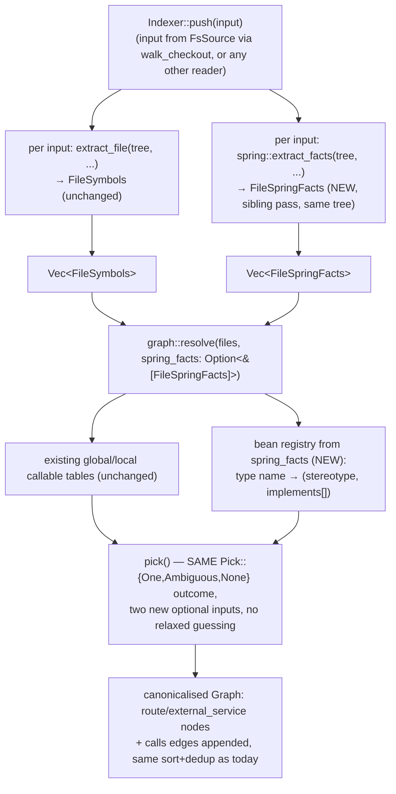

# Design exploration: a Spring-aware code graph

- **Status:** Phase 0 and Phase 1 implemented (see "What was built" below); Phase 2 not started, gated
  as this document always said it would be. The analysis and recommendation below are the historical
  record of that decision, kept intact — read them as reasoning, not as an aspirational spec of
  today's code.
- **Date:** 2026-08-08
- **Scope:** `lci-codegraph`'s Java support only. Spring Framework, Spring Boot, Spring Cloud.
- **Companion artifact:** a throwaway feasibility spike, `spring-spike/` (path in the accompanying
  report — not part of this crate, not committed here), proves the tree-sitter mechanics this
  document assumes rather than asserting them. Concrete findings are marked **[spike]** below.

## What was built

Phase 0 (§4.2 — general Java resolution, not Spring-specific) and Phase 1 (§2.1, §2.2, §4.3) landed.
Phase 2 (§2.3, §6) did not; see the gate below.

- **The crate split into a Cargo workspace**: [`crates/lci-codegraph-model`](../../crates/lci-codegraph-model)
  carries the shared `GraphNode`/`GraphEdge`/`Graph`/`def_node_id`/`FrameworkFacts`/`FrameworkCallTarget`
  vocabulary (§5.2's crate-boundary argument, taken as written), and
  [`crates/lci-codegraph-spring`](../../crates/lci-codegraph-spring) is the sibling extraction pass
  §3.2 describes: `extract_facts(&Tree, source, source_file) -> FrameworkFacts`.
- **`route` and `external_service` node kinds (§2.1), the Spring Data marker-interface carve-out
  (§4.3), and DI-aware `calls` resolution for the single-implementation case (§2.2)** are all in
  place, verified end to end against the committed fixture
  [`tests/fixtures/spring-repo/`](../../tests/fixtures/spring-repo) and its golden,
  [`tests/golden/spring-repo.graph.json`](../../tests/golden/spring-repo.graph.json).
- **§4.2's central prediction held, concretely**: `AccountController`'s
  `accountService.findByEmail(email)` — a field-injected call through an interface with one
  implementation — resolves to `AccountServiceImpl.findByEmail` through Phase 0 alone (declared-type
  qualifier recovery in `src/graph/callee.rs`, plus the supertype-aware match in `resolve::pick`), with
  **zero** Spring-specific knowledge involved anywhere in that edge. `lci-codegraph-spring` never runs
  on it.
- **Two deviations from this document, stated plainly rather than glossed over:**
  1. §2.1 said an `external_service` node would carry no `source_file`/`start_line` "in the usual
     sense." It carries both: it points at the `@FeignClient` interface declaration instead. `GraphNode`
     has no optional fields, so a synthetic empty path would have been just as much a fiction and
     strictly less useful than a real one — a real location hands a reviewer the file to open. The
     collision this creates (the same service name declared in two files) is collapsed deterministically
     in `resolve` (`dedup_colliding_node_ids`), keeping the node with the lexicographically lowest
     `(source_file, start_line)`.
  2. The Spring Data carve-out (§4.3) is per-file, exactly as scoped, which means it does not follow a
     *transitive* marker interface (one extending the repo's own base interface, which itself extends
     `JpaRepository`) and does not implement the `<Name>Impl` companion-class escape hatch §4.3 already
     flagged as a known caveat. With both present at once, the resolver sees two same-named candidates
     and drops the call — correct precision-favouring behaviour per §5.3's policy, but not the most
     useful outcome a reviewer could hope for.
- **Deliberately not built:**
  - **All of Phase 2** — the `injects` relation (§2.3) and `@Primary`/`@Qualifier` multi-implementation
    disambiguation (§4.3) — because §5.1's gate has not opened: the consumer repo's
    (`lightbridge-code-intelligence`) `get_callers` still hardcodes `relation: 'calls'`, so an `injects`
    edge would write cleanly and then sit completely unqueryable by anything that repo can call today.
    Shipping the write side alone would land edges nothing downstream can reach — precisely the mistake
    §5.1 names. Phase 2 starts once that repo's read side is generalized (or grows a Spring-specific
    tool), tracked as its own issue there, not here.
  - **A bean registry.** Nothing in this crate needs to consume one: Phase 0 already makes single-impl
    DI resolve generically, with no framework knowledge required, so a registry with no reader would be
    exactly the dormant code this project's delivery discipline argues against building.
  - **`persists` (§2.4), XML bean config, `@ComponentScan`, `@Profile`/conditional bean evaluation
    (§5.3)** — rejected as designed here, and still rejected.

## Recommendation, up front

Build a small slice, not the vocabulary this document's brief sketched. The reasoning splits the
problem in two, and the split is the main finding:

1. **Most of what looks like "Spring's call graph is a lie" is not Spring's fault.** It is a
   pre-existing, general gap in how the tags-based resolver qualifies an instance call
   (`accountService.findById(id)`) — a gap that bites *any* interface-typed, field-injected call in
   *any* Java codebase, framework or not. §4 proves this with a fixture that has no Spring annotation
   in it at all. Fixing it is not this document's proposal (it belongs in its own ticket, filed
   separately — see the closing note), but it changes the ROI math for everything below: build the
   general fix first, because a large share of the "Spring" value shows up for free once it lands.
2. **What is left after that fix is genuinely Spring-specific, and it is small:** recognizing Spring
   Data repository methods as valid call targets with no implementation to find (§4), and two
   additive node kinds — HTTP routes and outbound Feign clients — that need no new relation, no
   resolver change, and no change to the consumer's control plane at all (§2). That slice is worth
   building. A richer vocabulary (DI wiring edges, `@Primary`/`@Qualifier` disambiguation) is real but
   should wait for a downstream dependency this document did not expect to find (§5.1).

## 1. The problem

A code-review agent reading a Spring codebase today has two tools over the structural graph:
`lightbridge_graph_find_symbol` (substring match over a symbol's name / node id / file path) and
`lightbridge_graph_get_callers` (reverse traversal of the `calls` relation) — see
`services/review-agent/src/tools/graph.rs` in the consumer monorepo. Both are built on
`lci-codegraph`'s plain syntactic extraction: definitions and calls identified by tree-sitter node
kind, calls resolved by bare name plus an optional textual qualifier
(`src/graph/resolve.rs`, `src/graph/callee.rs`).

Three concrete questions a reviewer routinely needs answered, that this graph cannot answer today for
a Spring codebase:

- **"What actually runs when this controller method is hit?"** `AccountController.getAccount` calls
  `accountService.findById(id)`, where `accountService` is typed `AccountService` — an interface with
  one implementation, `AccountServiceImpl`, wired by `@Service` + constructor injection. Nothing in
  the source syntactically connects the call to the implementation; Spring's `ApplicationContext`
  does that at startup. `graph_get_callers(AccountServiceImpl.findById)` returns nothing.
- **"What does this repository method actually do?"** `AccountRepository.findByEmail` is a Spring
  Data derived-query method: its name alone tells Spring what SQL to generate. There is no method
  body anywhere in the source — not "elsewhere," *nowhere*. A reviewer who does not already know the
  Spring Data naming convention has no way to tell this apart from an abstract method someone forgot
  to implement.
- **"Does this change touch anything that talks to another service?"** `PaymentClient` is a
  `@FeignClient` — a declarative HTTP client to `payment-service`, a different codebase entirely. The
  graph has no concept of a service boundary; nothing marks this interface as different from any other
  unimplemented one.

**[spike]** These are not hypothetical. §4 runs `lci-codegraph`'s real, unmodified
`graph::extract_file` + `graph::resolve` over six realistic Spring files (a controller, a
service interface and implementation, a Spring Data repository, a JPA entity, a Feign client — full
listing in the spike) and gets **zero `calls` edges** — not "the three DI-mediated ones are missing,"
all of them, including plain non-DI instance calls. That result, and why, is the subject of §4.

## 2. Proposed vocabulary

Ruthlessly small, on purpose: every relation not listed here was considered and rejected (§7 explains
why for the ones a reader might expect, like `persists`).

### 2.1 Two new node kinds — no new relation, no control-plane change

Both are pure `GraphNode` additions. `GraphNode` is `{ node_id, label, source_file, start_line }`
(`src/graph/mod.rs`) — nothing about a node's *shape* is relation-dependent, and
`lightbridge_graph_find_symbol` matches by substring over `label` / `node_id` / `source_file` with no
relation involved at all (`services/control-plane/src/integrations/neo4j.rs::find_symbol`). These are
therefore queryable through the **existing, unmodified** retrieval tool, the day they ship.

- **`route`** — one node per HTTP endpoint, from the `@RequestMapping` family
  (`@GetMapping`/`@PostMapping`/`@PutMapping`/`@DeleteMapping`/`@PatchMapping`, plus bare
  `@RequestMapping`). `node_id` combines the HTTP method and the composed path (class-level prefix +
  method-level suffix, e.g. `route:GET:/api/accounts/{id}`); `label` is the same, human-readable
  (`GET /api/accounts/{id}`); **`source_file`/`start_line` point at the handler method**, not at a
  synthetic location — so finding the route *is* finding where it's handled, no edge traversal
  required.

  *Before:* a reviewer asking "what handles `GET /api/accounts/{id}`" has to grep every
  `@…Mapping` annotation in the diff and mentally compose class-level + method-level paths.
  *After:* `graph_find_symbol("/api/accounts/{id}")` returns the route node directly, with the
  handler's file and line.

- **`external_service`** — one node per distinct `@FeignClient(name = "…")` target, keyed by the
  declared service name (`node_id = "service:payment-service"`). No `source_file`/`start_line` in the
  usual sense (it names something outside this repo); the label is the service name.

  *Before:* "does this PR touch anything that calls `payment-service`" has no answer short of knowing
  to grep `@FeignClient` across the whole repo — and even then, the reviewer only sees the *outbound*
  declaration, not which of possibly many internal callers actually reach it.
  *After:* `graph_find_symbol("payment-service")` finds the node; once `calls` edges route through it
  (§2.2), `graph_get_callers` on it lists every internal call site, with zero grep.

This is the sharpest place a precomputed graph beats "the LLM reads the source" (§7): the
`@FeignClient` annotation itself is trivially visible to an LLM with file access — one grep. What
is *not* trivially visible, and does not get cheaper by reading more of *this* repo, is "which of the
other N files in this repo call it" (a repo-wide recall problem) and "what is the boundary of what
this review can see at all" (the callee's real implementation is in a different codebase, not
checked out, not readable no matter how carefully the diff is read).

### 2.2 One existing relation, better resolved — `calls`

The single highest-leverage move is not a new relation at all: it is making Spring-aware facts feed
the resolver that already produces `calls` edges, so the improvement is free to consume through
`graph_get_callers` with **no downstream change**. Concretely, once §4's carve-out lands:

- `AccountController.getAccount` **calls** `AccountServiceImpl.findById` (single-impl DI, resolved).
- `AccountServiceImpl.findById` **calls** `AccountRepository.findById` (Spring Data method kept as a
  valid terminal target instead of being silently unreachable).
- The `route` node for `GET /api/accounts/{id}` **calls** `AccountController.getAccount` (the
  container dispatches to the handler — an honest edge, not a fiction: something does call the
  handler, it is just the `DispatcherServlet`, not another symbol in this file).
- `AccountServiceImpl.create` **calls** the `external_service` node for `payment-service` (the Feign
  call site, resolved to the boundary marker instead of dropping).

*Before/after, concretely* **[spike]**: `graph_get_callers(AccountServiceImpl.findById)` returns `[]`
today (proven, not assumed — §4). After: `[AccountController.getAccount]`.

### 2.3 One genuinely new relation, deferred — `injects`

`injects` — from an `@Autowired`/constructor-injected field to the concrete bean chosen for it
(`AccountServiceImpl` → `AccountService`, recording *which* implementation was selected and why, e.g.
`@Primary` or a unique-candidate default). This is a real fact with real value ("if I change this
bean's wiring, what else is affected") but its value is realized entirely through edge traversal, and
`graph_get_callers` hardcodes `relation: 'calls'`
(`services/control-plane/src/integrations/neo4j.rs`, the `get_callers` Cypher). An `injects` edge
would write cleanly (§5.1) and then sit unqueried until the consumer generalizes that traversal or
adds a dedicated tool. **Recommendation: design the shape now, ship it only alongside that consumer
change** (§6, Phase 2) — shipping it before the read side exists delivers nothing.

### 2.4 Rejected: `persists`

A relation from a repository interface to the JPA entity it manages
(`AccountRepository` → `Account`, from `extends JpaRepository<Account, Long>`) was in scope to
consider and is explicitly rejected. The question it would answer — "what entity does this repository
touch" — is answered by *reading the interface's own `extends` clause*, which names the entity
directly, in the same line, with no cross-reference needed. **[spike]** confirms this is one glance,
not a search: `extends JpaRepository<Account, Long>` is fully readable without any graph. A relation
that duplicates information already sitting in the one line a reviewer would read anyway does not
earn a node, an edge, a write, or a maintenance burden. This is the concrete illustration of "propose
few, each earning its place" the brief asked for.

## 3. Where it plugs in architecturally

Four things need placing: annotation/route extraction (per-file), the Spring Data terminal-target
rule (per-file, but needs a distinguishing fact — see below), DI-aware call resolution (whole-program),
and the new node emission (whole-program, in `resolve`'s output).

### 3.1 Not a new `GraphStrategy`

`GraphStrategy` (`src/lang/mod.rs`) answers one question: *how are definitions and call sites found
in this language*. Spring does not change that answer for Java — a `@Service`-annotated class's
methods are ordinary `method_declaration` nodes, found exactly as `GraphStrategy::Tags` finds them
today. Adding `GraphStrategy::Framework` would incorrectly imply Spring changes *definition
discovery*; it changes *what else is true about a definition already discovered*. Java keeps
`GraphStrategy::Tags` unmodified.

### 3.2 A sibling per-file pass, not a `Classifier` change

`Classifier` (`src/graph/emit.rs`) answers exactly three questions per node: is this a definition,
is this a call site, what is the enclosing type scope. Annotations, route paths, and generic type
arguments are a different *kind* of fact — richer than `(kind, name)` — and do not fit that seam
without distorting it. **[spike]** confirms this practically: the spike's extraction code
(`annotations_of`, `describe_extends_interfaces`) is a second, independent walk over the *same* parsed
`Tree` `lang::parse` already produces, using node kinds (`marker_annotation`, `annotation`,
`super_interfaces`, `type_arguments`) `Classifier` never looks at. The natural fit is a **sibling
extraction module**, e.g. `graph::framework::spring::extract_facts(tree, source, source_file) ->
SpringFacts`, run alongside — not instead of — `extract_file`, over the one parse the crate already
has (preserving the one-parse design in `docs/architecture.md`).

Gate it cheaply: a Java file with no `org.springframework`/`jakarta.persistence` import in its
`import_declaration` list costs nothing beyond that one scan — the annotation walk never runs. This
matters for the crate's "pure extractor" identity (§5): a non-Spring Java repo, or a non-Java repo,
pays zero cost, and the gate is a genuine content check, not a disabled-by-default feature flag.

### 3.3 The whole-program half sits between per-file extraction and `resolve`

`docs/architecture.md`'s "Cross-file resolution" section is explicit that `resolve` is the *only*
place that looks across files, because attributing a call correctly needs every file's definitions
to exist first. DI resolution has the identical shape — "is there exactly one `@Service` bean
implementing this interface" cannot be answered from one file — so it belongs at the same point in
the pipeline, not inside per-file `extract_file`:



Concretely: `resolve` gains an optional parameter (or a sibling entrypoint,
`resolve_with_framework_facts`), defaulting to today's exact behaviour when absent — every non-Java
caller, and every Java repo `walk_checkout` didn't detect Spring imports in, is unaffected. This
mirrors how `WalkOptions::build_graph` already gates the whole graph pass; a `build_framework_graph`
sibling (auto-derived from "did any file import Spring," not a user-facing on/off switch left
dormant) is the same pattern one level down.

## 4. The declaration-vs-implementation tension

This is the section where the spike changed the shape of the answer.

### 4.1 The rule, and why it exists

PR #4 (commit `ddf37690`) established: **a declaration is a definition but not a call target.** A
trait/interface method with no body is indexed (searchable, has a node) but excluded from
`resolve`'s candidate pool, because a call dispatches to an implementation, never to a declaration —
and because the resolver is precision-favouring (`resolve.rs`: several same-named candidates with no
disambiguating qualifier are dropped, not fanned out), indexing a declaration as a candidate would
turn a clean single-impl case into a spurious two-candidate ambiguity. Issue #5 is the Java twin: at
the time this document was written, the Java `tags.scm` path did not yet apply this rule (`method_declaration`
was unconditionally a candidate regardless of whether it had a `body`), so a single-impl Java interface
call was **already broken today, independent of Spring** — dropped as ambiguous, not resolved.

**Note on timing:** while researching this document, issue #5's fix landed in the working tree of
this repository (visible as an uncommitted change to `src/graph/emit.rs`/`src/graph/tests.rs` at the
time of writing — this document does not modify it, only observes it). The evidence below is against
that fixed state, current as of 2026-08-08.

### 4.2 What issue #5's fix does and does not solve — proven, not assumed

**[spike]** Running the crate's real `graph::extract_file` + `graph::resolve` (unmodified) over the
six-file fixture set, `calls` edges resolved: **0**. Every one of them, including calls that have
nothing to do with interfaces or Spring at all.

Isolating why, with a two-class fixture with zero interfaces, zero annotations:

```java
// Helper.java
class Helper { void help() {} }
// Caller.java
class Caller { void run() { Helper h = new Helper(); h.help(); } }
```

This also produces **zero** `calls` edges. The mechanism: `graph::callee::qualifier_from_callee_node`
recovers a call's qualifier as the *literal receiver identifier text* — for `h.help()`, that is `"h"`,
the variable name, not `"Helper"`, the type. `resolve::pick`'s single-candidate branch rejects a
candidate whenever a present qualifier does not textually equal the candidate's scope
(`only.scope.as_deref() != Some(q)` in the doc comment; the code is `q != scope`). `"h" != "Helper"`,
so the one real, unambiguous, single candidate is rejected, not accepted. This is already documented
inside the crate's own test suite as a known, explicitly out-of-scope-for-#5 limitation
(`java_call_through_an_interface_typed_variable_needs_a_qualifier_match`, `src/graph/tests.rs`) — the
spike's contribution is showing it is not a narrow interface-only corner case: it blocks the
overwhelmingly common Java idiom of calling a method through a lowercase-named field or local
variable, which is most instance calls in idiomatic Java.

This means **the single-impl `@Service` interface example from this document's brief resolves for a
reason that has nothing to do with Spring at all, once two things are true**, neither of which
requires reading a single annotation:

1. Issue #5's fix (already landing): exclude bodiless declarations from candidacy, so
   `AccountService.findById` (declaration) stops competing with `AccountServiceImpl.findById`
   (implementation) for the name — candidate count 2 → 1.
2. A **general, non-Spring resolver enhancement**, not proposed by this document but a direct
   prerequisite for any of it mattering: recover a receiver's *declared* type (from the field or
   parameter declaration in the same file) as the qualifier, instead of the bare identifier text —
   and treat a qualifier that names an interface the sole candidate's class implements as a match,
   not only an exact scope-name match (the same kind of "module qualifier doesn't contradict a
   scopeless candidate" leniency `pick()` already applies elsewhere, extended one step).

**[spike]** confirms the candidate-count half of this concretely: across the six fixtures,
`findById`/`findAll`/`create`/`findByEmail` all go from 2 same-named candidates (declaration +
implementation, ambiguous) to exactly 1 (implementation only) once bodiless declarations are excluded
— see the spike's `simulate_post_issue5_resolution` output. Getting from "1 candidate" to "resolved
edge" additionally needs item 2, which this document flags as its own ticket rather than folding into
Spring scope, precisely because it is not Spring-specific: it would fix the identical shape of call in
any Java codebase with an interface and one implementation, framework or not.

**Filed separately, not fixed here or in this document:** the qualifier-vs-declared-type gap above is
being tracked as its own issue in `lci-codegraph`, independent of Spring, because it changes the ROI
of Spring-specific work materially (see the recommendation at the top of this document) and is
squarely general Java-resolution debt rather than a framework concern.

### 4.3 Where Spring-specific knowledge is genuinely required

Once the general fix in §4.2 lands, exactly two situations remain where framework knowledge — not
general Java semantics — is the only thing that can help:

- **Multiple `@Service`/`@Component`/`@Repository` implementations of one interface.** Candidate
  count stays > 1 no matter how the qualifier is resolved, because there genuinely are multiple bodied
  implementations. Spring's own disambiguation is `@Primary` (pick the marked one) then `@Qualifier`
  (match a bean name) then, failing both, **Spring itself refuses to start**. The graph should mirror
  exactly this — resolve when `@Primary`/`@Qualifier` make the choice unambiguous, stay silent
  otherwise — never invent a resolution Spring's own container would not produce either. This is
  `injects`-relation territory (§2.3), deferred to Phase 2.

- **Spring Data repository methods.** `AccountRepository.findByEmail` has zero bodied candidates
  anywhere in source, by design — Spring generates the implementation from the method name at
  runtime. Under the plain declaration-exclusion rule this becomes a permanently unreachable node
  (**[spike]**: `findByStatus`/`registerAccount` both show `today=1, post-#5=0` — going from "resolves
  to the declaration, which is wrong but at least present" to "no candidate, silently invisible,"
  which is a real regression in *coverage* even though it is a correct application of the general
  rule). **Recommendation:** a narrow, syntactically-provable carve-out — a `method_declaration` with
  no body, inside an interface whose `extends_interfaces`/`super_interfaces` clause names a Spring
  Data marker interface (`Repository`, `CrudRepository`, `PagingAndSortingRepository`,
  `JpaRepository`, `ReactiveCrudRepository`, `MongoRepository`, …, matched by simple name — resolving
  the fully-qualified type would need classpath information this crate does not have and should not
  try to get), is kept as a valid terminal call target. This is not "guess when unsure" — it is
  "recognize one specific, structurally checkable, framework-documented contract": Spring Data
  positively guarantees no other implementation will ever exist in source. That is a fact, not an
  inference, and it is exactly the kind of thing worth hand-coding narrowly rather than generalizing.

  One caveat worth flagging without designing around it yet: Spring Data's own escape hatch for
  custom logic is a companion `<RepositoryName>Impl` class (e.g. `AccountRepositoryImpl`), which,
  when present, *does* provide a real bodied implementation that should win over the carve-out. Not
  required for a useful first slice (§6) — noted so it is not rediscovered as a surprise later.

## 5. Honest cost and risk

### 5.1 The write/read asymmetry — the load-bearing correction to this document's own starting premise

The brief's working assumption was that a new `relation` value is free downstream because the Neo4j
write is schema-generic. **Verified, and the write half is true**: `upsert_graph` in
`services/control-plane/src/integrations/neo4j.rs` writes `MERGE (a)-[r:REL {relation: $rel}]->(b)` —
`relation` is a Cypher *property* on one generic edge type, chosen specifically because "Cypher can't
parameterize labels/relationship types, and a property keeps the write a single prepared statement"
(the file's own comment). Emitting `injects`, or any other new relation string, needs zero migration
and zero control-plane write change.

**The read half is not free, and this materially changes the phasing.** The same file's
`get_callers` hardcodes the traversal: `-[:REL {relation: 'calls'}]->`. `graph_find_symbol` never
looks at relations at all — it matches node properties only. So: a brand-new relation like `injects`
would write cleanly and then be **completely unqueryable** by anything the review agent can currently
call, until the control plane either generalizes `get_callers` to accept a `relation` parameter or
ships a Spring-specific tool. That is a change in a **different repository**
(`lightbridge-code-intelligence`, not `lci-codegraph`), coordinated separately, on a timeline this
crate does not control.

This is exactly why §2's vocabulary is shaped the way it is: the phase-1 slice (route/external_service
nodes, better-resolved `calls` edges) was chosen specifically because it needs *no* consumer-side
change — nodes are queryable via unmodified `find_symbol`, and reusing the existing `calls` relation
means `get_callers` traverses the improvement for free. `injects`, which does need the read-side
generalization, is deferred to Phase 2 with that dependency stated as a gate, not an afterthought.

### 5.2 What this does to "pure extractor, no framework knowledge"

The crate's identity is real and worth protecting: `src/lib.rs`'s own module doc is explicit that
this crate "holds no `kube`/`sqlx`/forge dependencies" and that "the host maps [chunks and the graph]
onto the internal-API payloads … and submits" — the crate never talks to a datastore, a cluster, or a
forge. Spring-awareness does not cross that
line — it stays inside "parses a checkout, returns nodes and edges" — but it does add something the
crate has so far avoided: knowledge of a specific *library's* API surface (annotation names,
Spring Data marker interfaces), which is a different and narrower kind of coupling than "a
tree-sitter grammar for a language." A grammar changes rarely and is maintained by someone else;
Spring's annotation set changes every major/minor release (this document's own fixtures mix
`jakarta.persistence` with `javax.persistence`-era conventions still common in the field — Spring
Boot 3's Jakarta EE migration is exactly the kind of churn this maintenance surface means signing up
for). Scoping it to a small, explicit annotation/marker-interface allowlist (not a general "understand
Spring" ambition) keeps this bounded, but it is genuinely new, ongoing curation work, not a one-time
cost.

### 5.3 Where static analysis stops being able to tell the truth

Three real limits, in increasing order of how badly they undermine a *precomputed* answer:

- **XML bean configuration.** Legacy Spring apps wire beans in `applicationContext.xml`, entirely
  outside the Java AST this crate parses. A repo using XML config would see the graph confidently
  claim "no bean provides this interface" when one exists — worse than saying nothing, because it
  looks authoritative. **Recommendation: stay silent.** Do not attempt to parse Spring XML; a
  Java-file-only DI graph should be documented as exactly that, not as complete DI awareness.
- **`@ComponentScan(basePackages = …, excludeFilters = …)`.** Whether a given `@Service` class is even
  picked up as a bean can depend on scan configuration this crate has no way to evaluate (it does not
  resolve package structure against classpath boundaries). The safe default: assume every
  `@Component`-family annotation is live unless there is a clear, syntactically obvious reason not to
  — which mirrors how the resolver already treats ambiguity: resolve when a fact is provable, stay
  silent otherwise, never guess to fill a gap.
- **`@Profile`/`@ConditionalOnProperty`.** Which bean is actually active depends on which Spring
  profile is running and what property values are set — genuinely not statically decidable, full
  stop, for any tool, not just this one. The graph should not pick one profile's answer over
  another's; it should either emit both candidates as `Pick::Ambiguous` (drop, don't guess) or, if a
  `@Profile` conditions the *entirety* of the candidate set to two truly mutually-exclusive options,
  say so explicitly in a way a reviewer can act on rather than silently choosing one.

**This is consistent with the crate's existing policy, not a new one.** `resolve.rs`'s ADR-0086 R5
rule — several same-named candidates with no disambiguating qualifier are dropped and counted, never
guessed — is precisely the right posture here too. The recommendation throughout this document is:
apply the same discipline one layer up, to framework-level ambiguity, rather than relaxing it because
the ambiguity now has an annotation attached to it.

## 6. Phasing

**Phase 0 (prerequisite, not Spring-specific, filed separately):** the declared-type qualifier fix
from §4.2. Blocks a meaningful share of this document's value; delivers value on its own, to every
Java repo, Spring or not.

**Phase 1 (the recommended slice — self-contained, no cross-repo dependency):**

- `route` and `external_service` `GraphNode`s (§2.1).
- The Spring Data marker-interface carve-out in the terminal-call-target rule (§4.3).
- DI-aware resolution feeding the *existing* `calls` relation for the single-impl case (§2.2) —
  gated on Phase 0.
- Definition of done includes a live check that the improvement is visible through
  `graph_find_symbol`/`graph_get_callers` **as they exist today**, with no consumer-repo change
  required — that constraint is what makes this phase shippable independently.

**Phase 2 (gated on a consumer-repo change — explicit go/no-go, not silently deferred):**

- The `injects` relation (§2.3).
- `@Primary`/`@Qualifier` multi-impl disambiguation (§4.3).
- Either a generalized `graph_get_callers(relation: …)` or a Spring-specific retrieval tool in
  `lightbridge-code-intelligence`, tracked as its own issue in that repository before Phase 2 work
  starts here — shipping the write side first without a plan for the read side repeats exactly the
  mistake §5.1 flags.

**Not planned:** XML bean config, full `@ComponentScan`/classpath resolution, `@Profile`/conditional
bean evaluation, `persists` (§2.4), a general "understand Spring" ambition of any kind.

## 7. Alternatives considered and rejected

- **Do nothing.** A real option, and stronger than it first looks: Phase 0 alone (general, non-Spring)
  already resolves a meaningful share of the DI-shaped calls in this document's own fixtures with zero
  framework knowledge (§4.2). It is entirely possible that landing Phase 0 and re-measuring is the
  right place to stop, and re-evaluating Spring-specific work only if the remaining gap (Spring Data,
  multi-impl beans, routes, Feign) still shows up as a real cost in practice. This document does not
  argue against pausing there.

- **Let the LLM infer Spring wiring from the source it already reads.** A serious alternative, not a
  strawman, because the consumer is an LLM agent with file access, and Spring's stereotype
  annotations (`@Service`, `@Autowired`, `@FeignClient`) are not hidden — they are plain text sitting
  right next to the code a reviewer is already reading. For same-repo, same-PR reasoning ("this
  interface has one implementation, right there in the diff") an LLM reviewer with the file open needs
  no graph at all, and after Phase 0 + issue #5 land, the graph will increasingly agree with what the
  LLM could already see unaided — which is a *good* outcome, not a wasted one; it means the graph is
  telling the truth. The graph earns its keep specifically where reading-the-diff does not scale:
  **repo-wide reverse lookups** ("who else, anywhere in this repo, calls this bean" — a recall problem
  across potentially hundreds of files an LLM cannot exhaustively re-read every review), and
  **genuine cross-repository boundaries** (`@FeignClient` names a service whose implementation is not
  checked out in this review at all — no amount of careful reading of *this* repo supplies information
  that lives in a different one). §2.1's `route`/`external_service` nodes and §2.2's DI-aware `calls`
  resolution were chosen specifically because they sit in that gap; a hypothetical `persists` relation
  (§2.4) was rejected specifically because it does not.

- **Full framework-semantic simulation** — a mini Spring container that actually resolves beans the
  way `ApplicationContext` does, including XML and profiles. Rejected outright: it requires classpath
  resolution, environment/property evaluation, and XML parsing this crate has no access to and should
  not acquire: it is a different, much larger engineering project (arguably "embed a subset of
  Spring"), it directly violates the precision-favouring policy (§5.3), and it chases a moving target
  — Spring's own annotation surface changes every release, and a simulation has to track *behavior*,
  not just syntax, to stay correct. The scoped, syntactically-grounded carve-outs in §4.3 get most of
  the real value without this cost.
